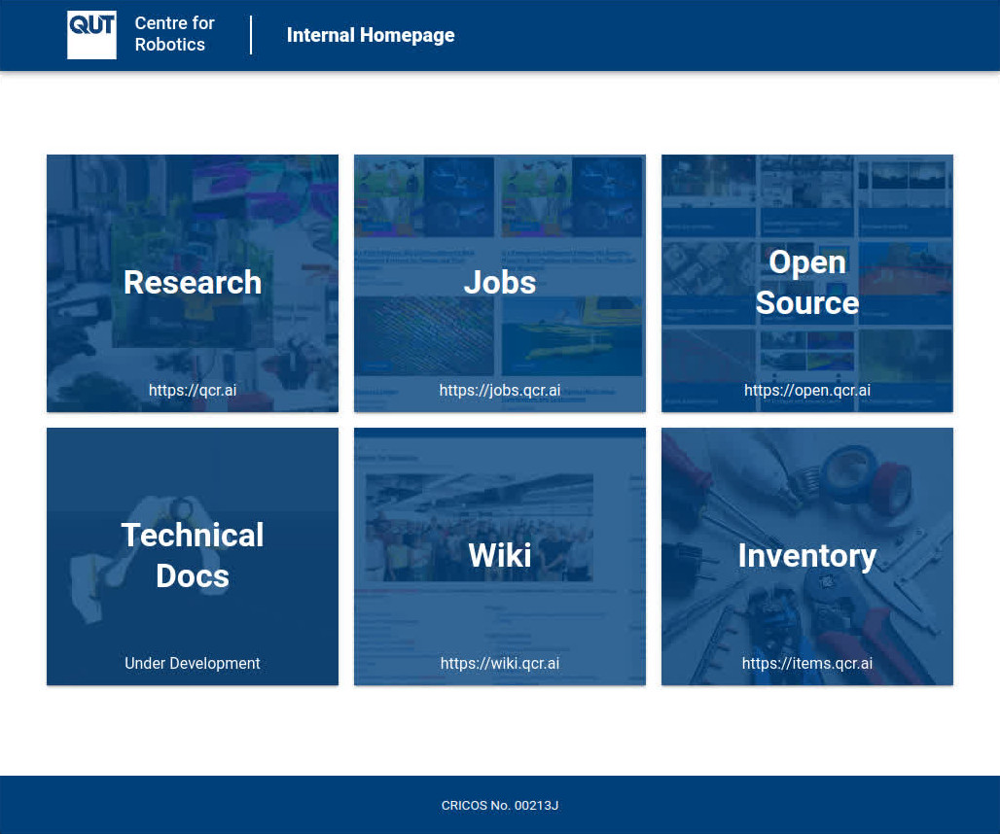

# QCR's internal home page

This repository contains the resources that build our [internal home page](https://home.qcr.ai).

## Documentation

TODO update link below with stable link when they exist

All documentation has moved internally to our [technical documentation site](https://docs.qcr.ai).
